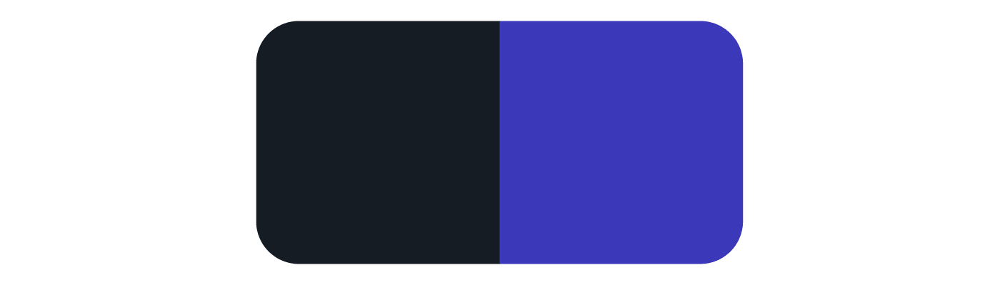
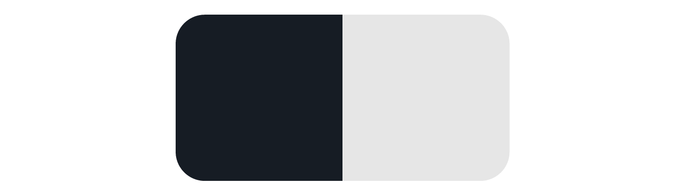
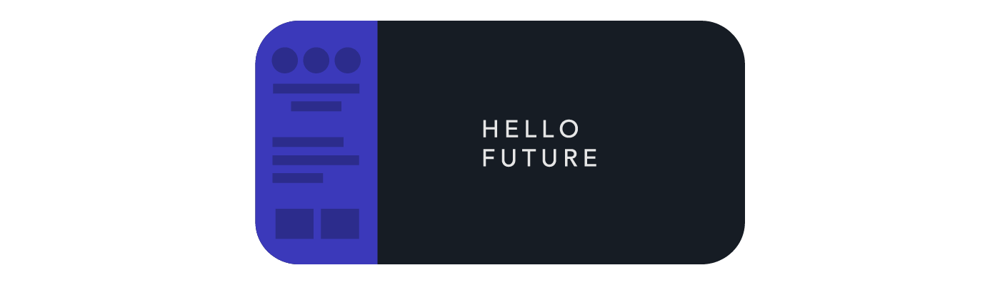

# Fastcampus UX/UI Design SCHOOL
## HTML/CSS
Day 1. Intro to HTML

---
<!--
page_number: true
$size: A4
footer : fastcampus UX/UI Design SCHOOL, Wooyoung Choi, 2017
-->
## Introduce
### 최우영

- Solution Architect, Web Developer, Instructor
- Skills: Python, Golang, Julia, Node.js, Google tag manager ...

#### blog: https://blog.ulgoon.com/
#### github: https://github.com/ulgoon/
#### email: me@ulgoon.com

---
## HTML/CSS

---
## Goal

- 웹의 역사와 구성요소에 대해 이해할 수 있다.
- 웹 표준에 대해 이해하여 어떤 브라우저에서도 일관성 있는 문서를 생산할 수 있다.
- 웹 접근성에 대해 이해하며, 모든 사용자가 접근 가능한 문서를 생산할 수 있다.
- HTML을 이해하고 상황에 맞는 태그를 사용할 수 있다.
- CSS를 이해하고 원하는 대로 스타일링 할 수 있다.

---
## Understanding of web

---
## History of web

---
## intranet vs Internet vs internet
- intranet: internet의 www기술을 활용하여 특정 단체의 내부 정보시스템을 구축하는 것 혹은 그 네트워크
- Internet(`International Network`): TCP/IP를 활용하여 정보를 주고 받는 통신 네트워크(www)
- internet(`internetwork`): 패킷을 교환하는 방식으로 기기간의 정보를 주고 받는 방식

---
### Web architecture


---
### 웹 개발 패턴의 변화

- 1991 ~ 1999: Sir Timothy John "Tim" Berners-Lee가 하이퍼텍스트 기반의 프로젝트를 제안한 이후 정적인 컨텐츠들을 중심으로 한 웹 기술이 발달
- 1999 ~ 2009: Linux, Apache, Mysql, Php 중심의 동적인 서버, 정적인 클라이언트 모델이 지속됨
- 2010 ~ 현재: Javascript!! (Dynamic Web Client)

---
## IP and Domain


---
## URI, URL, URN

### URI 
- Uniform Resource Information
- `https://www.example.com/post/how-to-make-url`
### URL 
- Uniform Resource Locator
- `https://www.example.com/post/`

### URN 
- Uniform Resource Name
- `www.example.com/post/how-to-make-url`

---
## Web Standard
- 웹사이트를 만들 때 지켜야 할 약속
- International System of Units(SI)


---
## Web Standard
- Accessibility
- Privacy
- Security
- Internationalization

---
## Accessibility
- 누구나 원활하게 웹페이지를 이용할 수 있어야 함!!
```html
<button>제출하기</button>
<a href=""></a>
```

---
## Accessibility
1. 인지가능성
	1. 텍스트가 아닌 것은 대체 텍스트를 제공해야 함
	2. 시간기반 컨텐츠는 대체 컨텐츠를 제공해야 함
	3. 정보를 구조화 한 뒤, 레이아웃을 꾸며야 함
	4. 사용자가 컨텐츠를 구분할 수 있도록 만들어야 함
2. 작동가능성
	1. 키보드로 모든 것을 제어할 수 있도록 제공
	2. 컨텐츠를 읽을 충분한 시간
	3. 사용자의 현재 위치를 잘 알 수 있도록 제공


---
## Accessibility

3. 가독성
	1. 텍스트 컨텐츠를 읽기 쉽게 제공
	2. 사용자가 예측 가능하게 작동
	3. 사용자의 실수를 방지 
4. 호환성
	1. 장애가 있는 사용자가 과거와 현재 미래의 보조 기술들을 모두 사용할 수 있도록 호환성을 유지  

---
## Web Design

---
## Web Design - CLI
(reference: Sandijs Ruluks)


---
## Web Design - table tag


---
## Web Design - javascript


---
## Web Design - Adobe flash


---
## Web Design - CSS


---
## Web Design - column design for mobile


---
## Web Design - responsive web design


---
## Web Design - flat


---
## Web Design - future


---
## Fundamentals of Web design
- Typography
- Color
- Grid
- Responsive Design

---
## HTML Basic

---
## HTML
HyperText Markup Language의 줄임말

https://www.w3.org/People/Berners-Lee/

---
## Requirement
### sublime text (https://www.sublimetext.com/)
### Visual Studio Code
### vim
### notepad
### ...

---
## HTML
```html
<!DOCTYPE html>
<html>
  <head>
    <meta charset="utf-8">
    <title>My first HTML page</title>
  </head>
  <body>
    <h1>HTML Intro</h1>
    <p>Hello world!</p>
  </body>
</html>
```

---
## text tag
```html
<font size="6"><b>Awful Heading 1</b></font>
```
```html
<h1>Awesome heading 1</h1>
```

---
## text style
```html
<font style="font-style:italic;">usless italic</font>
<i>just italic</i>
<em>Semantic italic</em>

<font style="font-style:bold;">useless bold</font>
<b>just bold</b>
<strong>semantic bold</strong>
```

---
## text style
```html
<mark>형광펜 효과</mark>
<blockquote>인용문 블록</blockquote>
<q>문장 속 인용</q>
<pre>
    텍스트 내용 그대로 보여주기
    console.log("hello world!");
</pre>
<abbr title="Google Tag Manager">GTM</abbr>
<u>밑줄!!!!!</u>
<s>취소선~~~</s>
<small>작게 표시하기!!</small>
<sub>아래첨자</sub>
<sup>위 첨자</sup>
```

---
## DOM
Document Object Model

```html
<!doctype html>
<html>
 <head>
  <meta charset="utf-8">
  <title>My page</title>
 </head>
 <body>
  <h1>Home</h1>
  <p>Hello there!</p>
 </body>
</html>
```

---
## DOM


---
## HTML5 Semantic Elements
```html
<!doctype html>

<html>
 <head>
 <!-- google tag manager 1st code snippet -->
  <meta charset="utf-8">
  <meta name="viewport" 
  content="width=device-width, initial-scale=1.0">
  <title>My page</title>
 </head>
 <body>
   <!-- google tag manager 2nd code snippet -->
  <h1>Home</h1>
  <p>Hello there!</p>
 </body>
</html>
```

---
## HTML5 Semantic Elements


---
## HTML5 Semantic Elements - header
```html
<header>
 <h3>This is header</h3>
</header>
<nav>
 <a href="#">Home</a> |
 <a href="#">Blog</a> |
 <a href="#">Picture</a> |
 <a href="#">About</a>
</nav>
```

---
## HTML5 Semantic Elements - contents
```html
<section>
 <h4>Section!!</h4>
 <p>A section is a thematic grouping of content, 
 typically with a heading
 </p>
</section>
<article>

</article>
```

---
## HTML5 Semantic Elements - contents
```html
<aside>
 side menu(recent post, side nav, ..)
</aside>
```

---
## HTML5 Semantic Elements - footer
```html
<footer>
 <h3>This is footer</h3>
</footer>
```

---
## `<br>, <p>`
```html
<p>
Donec ullamcorper nulla non metus auctor fringilla. 
Fusce dapibus, tellus ac cursus commodo, tortor mauris condimentum nibh, ut fermentum massa justo sit amet risus. 
Sed posuere consectetur est at lobortis.
Aenean lacinia bibendum nulla sed consectetur.
Etiam porta sem malesuada magna mollis euismod.
</p>
```
```html
This <br> is <br> Line <br> Break!!!
```

---
## `<ul>, <ol>, <dl>, <a>, `

---
## `<ul>`
: Unordered List

```html
<ul>
 <li>This</li>
 <li>is</li>
 <li>unordered</li>
 <li>list</li>
</ul>
```

---
## `<ol>`
: Ordered List

```html
<ol>
 <li>This</li>
 <li>is</li>
 <li>ordered</li>
 <li>list</li>
</ol>
```

---
## `<ol>`
- option
	- type: specifies the kind of marker to use in the list
		- `type="I"`(1, a, A, i, I)
	- start: specifies the start value of the first list item
		- `start="10"` 

---
## `<dl>`
:Description list
```html
<dl>
 <dt>Describe</dt>
  <dd>1.(~이 어떠한지를) 말하다, 묘사하다</dd>
  <dd>2.(움직임으로 특정한 형태를) 만들다</dd>
</dl>
```

---
## `<a>`
`<a href="Hypertext REFerence">Link text</a>`
<a href="http://www.google.com">Like this</a>

- option
	- target: `_self`(default), `_blank`, ..
		- `target="_blank"` 
	- hreflang: Specifies the language code(ko, en, jp, ...)
		- `hreflang="ko"`

---
## `<a>` to make link within a PAGE
```html
<div id="top"></div>
...
<a href="#top">Go to Top</a>
```


---
## ``
``

- option
	- height: Specifies the height of the image
		- `height="150"`(pixels)
    - width: Specifies the width of the image
		- `width="120"`(pixels)

---
## `<figure>` & `<figcaption>`
`<figure> 요소 </figure>`
`<figcaption> 설명하는 글 </figcaption>`

```html
<figure>
 
 <figcaption>Some text</figcaption>
</figure>
```

---
## multiple Links in 1 image
```html

 <map name="boxes">
 <area shape="rect" coords="" href="link1" target="_blank"> 
 <area shape="rect" coords="" href="link2" target="_blank">
 </map>
```

`coordination`: "`1x, 1y`, `2x, 2y`"

